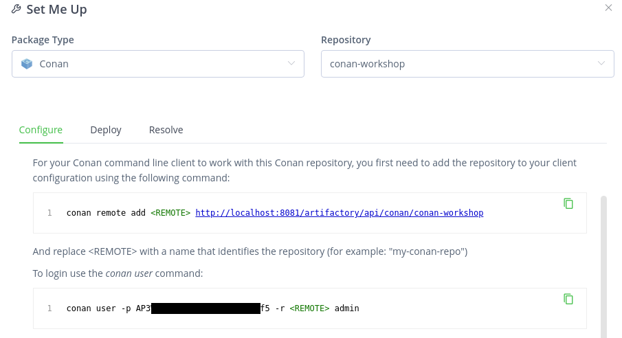

# 01_artifactory_conan_preparation

Now lets prepare the working environment a little bit.

## Run docker services

Run docker compose services and wait for Artifactory to start.

```script
docker-compose up -d
docker logs -f artifactory
```

## Create local conan repository in artifactory

1. Open in local browser: [http://localhost:8082](http://localhost:8082)
2. Login: `admin`, password: `password`. For learning purposes we don't need
to change them, but sometimes artifactory forces the change.
3. In the left menu go to "Repositories" -> "Repositories".
4. In the right upper corner select "Add Repositories" -> "Local Repository".
5. Select "Conan" repository type. Put some "Repository key", e.g. `conan-workshop`.
And hit "Create Local Repository"

## Set up "dev" container

Right now we have to prepare the dev container.

1. Attach new shell to docker `dev` container: `docker exec -it dev bash`.
2. Install conan. Simply `pip install conan`.
3. Add previously created remote conan remote. By default artifactory container
host is available in the network under name `artifactory`.

    ```script
    conan remote add <REMOTE_NAME> <REMOTE_URL>
    # e.g.
    conan remote add conan-workshop http://artifactory:8081/artifactory/api/conan/conan-workshop
    ```

4. Set default authentication user for this remote.

    ```script
    conan user -p <PASSWORD_OR_API_KEY> -r <REMOTE_NAME> <USER>
    # e.g.
    conan user -p password -r conan-workshop admin
    ```

5. You should see new remote in list: `conan remote list`.

## Appendix - retrieve needed credentials from artifactory

It is also possible to "automatically" get the set-up commands from Artifactory
webpage. We didn't use it, because for us, the server address is different,
than the one automatically showed.

1. First let's move back to the Artifactory page.
2. In the left menu change to "Application" tab.
3. "Artifactory" -> "Artifacts". Select previously created repository from list.
4. Click "Set Me Up" in the right corner and put your password (`password` by
default) in the "Type Password" field.

Right now we can see almost ready commands.

